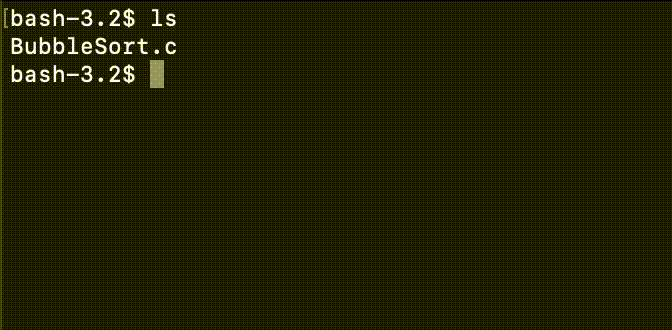

# BubbleSort

## 概要
いろんな言語でバブルソートする。

## 利用するデータ
要素数10の以下の配列を利用する。 data = [54,78,12,2,89,25,78,29,69,35]

## バブルソートについて
バブルソートは整列アルゴリズムの一つで、隣り合う要素を比較し条件に応じて要素交換を行うことで、配列を昇順・降順に並べ替えることができる。

## Demo

 （C言語）

## Usage
- [C](https://github.com/sudo-roa/BubbleSort/tree/main/C)
- [Python3](https://github.com/sudo-roa/BubbleSort/tree/main/Python3)
- [Ruby](https://github.com/sudo-roa/BubbleSort/tree/main/Ruby)

## Author
[sudo-roa](https://github.com/sudo-roa)
